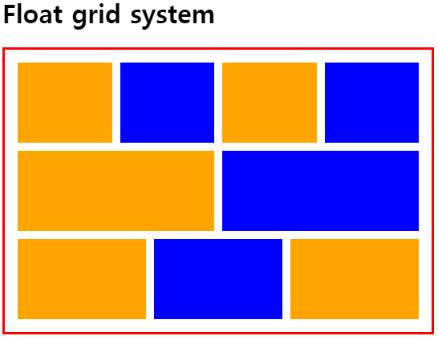
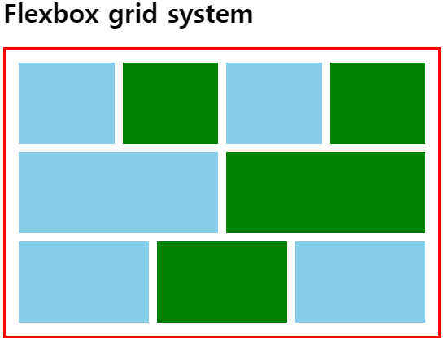
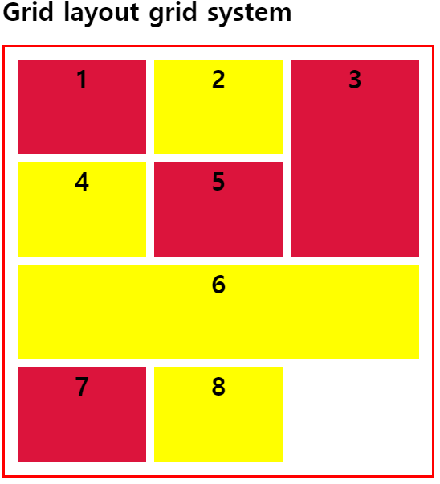

# 그리드 시스템

그리드 레이아웃을 구현하기 위해 설계한 시스템으로 너비 960px 혹은 1200px 기준으로 정해놓은 시스템들이 있다. 열(Column)의 개수에 따라 12단/16단/24단 그리드라고 부르기도 한다. 그리드 레이아웃을 구현하는 방법은 여러가지가 있으며 여기선 12단 그리드로 진행한다.

> float, flexbox, grid의 기본개념과 문법들에 대해 알고있어야 한다.

<br>

## Float grid system

flexbox나 grid가 나오기 이전에 사용하던 방식으로 float 속성을 사용하여 구현한다. float된 높이를 잡기 위해 clearfix 핵을 사용해야 하며 각 너비를 열/행의 간격에 맞게 계산해주어야 한다.

**[Codepen](https://codepen.io/BaeHaram/pen/XWbYpwx) 에서 꼭 직접 해보자!**



```html
<h1>Float grid system</h1>
<div class="container">
  <div class="row">
    <div class="col col-3-12"></div>
    <div class="col col-3-12"></div>
    <div class="col col-3-12"></div>
    <div class="col col-3-12"></div>
  </div>
  <div class="row">
    <div class="col col-6-12"></div>
    <div class="col col-6-12"></div>
  </div>
  <div class="row">
    <div class="col col-4-12"></div>
    <div class="col col-4-12"></div>
    <div class="col col-4-12"></div>
  </div>
</div>
```

```css
:root {
  --gutter: 10px;
}
.container { 
  width: 500px;
  border: 3px solid red;
  padding: 1rem;
}
.row::after {
  content: '';
  display: block;
  clear: both;
}

.row + .row {
  margin-top: var(--gutter);
}

.col {
  height: 100px;
  background-color: orange;
  float: left;
  margin-right: var(--gutter);
}

.col:last-child { margin-right: 0; }

.col-1-12 { width: calc(100%/(12/1) - var(--gutter)*11/12); }
.col-2-12 { width: calc(100%/(12/2) - var(--gutter)*10/12); }
.col-3-12 { width: calc(100%/(12/3) - var(--gutter)*9/12); }
.col-4-12 { width: calc(100%/(12/4) - var(--gutter)*8/12); }
.col-5-12 { width: calc(100%/(12/5) - var(--gutter)*7/12); }
.col-6-12 { width: calc(100%/(12/6) - var(--gutter)*6/12); }
.col-7-12 { width: calc(100%/(12/7) - var(--gutter)*5/12); }
.col-8-12 { width: calc(100%/(12/8) - var(--gutter)*4/12); }
.col-9-12 { width: calc(100%/(12/9) - var(--gutter)*3/12); }
.col-10-12 { width: calc(100%/(12/10) - var(--gutter)*2/12); }
.col-11-12 { width: calc(100%/(12/11) - var(--gutter)*1/12); }
.col-12-12 { width: calc(100%/(12/12) - var(--gutter)*0/12); }


.col:nth-child(even) {
  background-color: blue;
}
```

`row::after` 로 clearfix 핵을 적용하였고 행의 `margin` 으로 수직 간격을, 열의 `margin` 으로 수평 간격을 지정하였다. 또한 12단 그리드이기 때문에 `.col-x-12` 가 뜻하는 것은 12단 중에 x개를 차지하는 너비를 말한다. 간격에 유동적으로 적용하기 위해 간격변수인 `--gutter` 기준으로 계산하였다.

<br>

## Flexbox grid system

**[Codepen](https://codepen.io/BaeHaram/pen/oNXyZvv) 에서 꼭 직접 해보자!**



대부분 float를 사용한 방식과 동일하되, clearfix 핵을 없애고 flex를 적용한 것이다.

```css
/*.row::after {
  content: '';
  display: block;
  clear: both;
}*/
.row {
  display: flex;
}
```

<br>

## Grid layout grid system

grid를 사용한 경우로, float/flexbox와는 완전히 다르다. 너비를 계산하지도 않고 `row` 나 `column` 을 따로 지정하지 않는다. 단순하게 grid 관련된 속성을 사용해서 열/행의 너비 및 높이와 각 항목의 비율을 지정한다.

**[Codepen](https://codepen.io/BaeHaram/pen/JjdZWoQ) 에서 꼭 직접 해보자!**



```html
<h1>Grid layout grid system</h1>
<div class="container">
  <div class="grid">
    <div class="item item-1">1</div>
    <div class="item item-2">2</div>
    <div class="item item-3">3</div>
    <div class="item item-4">4</div>
    <div class="item item-5">5</div>
    <div class="item item-6">6</div>
    <div class="item item-7">7</div>
    <div class="item item-8">8</div>
  </div>
</div>
```

```css
.container { 
  width: 500px;
  border: 3px solid red;
  padding: 1rem;
}

.grid {
  display: grid;
  height: 500px;
  grid-template-rows: repeat(4,1fr);
  grid-template-columns: repeat(3,1fr);
  grid-row-gap: 10px;
  grid-column-gap: 10px;
}

.item {
  background-color: crimson;
  text-align: center;
  font-size: 2rem;
  font-weight: bold;
}

.item:nth-child(even) {
  background-color: yellow;
}

.item-3 {
  grid-row: 1/3;
  grid-column-start: 3;
}

.item-6 {
  grid-column: 1/4;
  grid-row: 3/4;
}
```

<br>

## 참고

* [Sass로 12단 그리드 시스템 만드는 법](https://medium.com/fluosoup/sass로-12단-그리드-시스템-만드는-법-d2c7cf54c36)
* [CSS Grid 완벽 가이드](https://heropy.blog/2019/08/17/css-grid/)