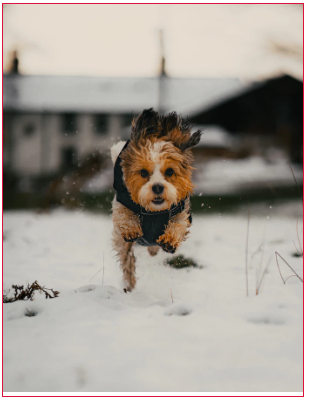
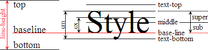

# img 아래쪽 공백 제거

## img의 공백

`` 태그를 사용할 때 기본적으로 아래쪽에 공백이 생긴다.

```html
<div class="container">
  
</div>
```

```css
.container {
  width: 300px;
  border: 1px solid crimson;
}

img {
  max-width: 100%;
}
```

<p align="center">
	
</p>

<br>

## 공백이 생기는 이유

`` 태그는 인라인-레벨 요소이기 때문에 기본적으로 일반 텍스트와 동일하게 baseline 기준으로 정렬이 된다. 이 말은 즉, `vertical-align: baseline` 이 기본값이라는 말이다.

<p align="center">
	
</p>

[이미지 출처](https://stackoverflow.com/a/34952703/11789111)

위 그림에서 텍스트가 baseline 기준으로 정렬된 것을 볼 수 있는데 `` 도 마찬가지이다. baseline 기준으로 정렬된 인라인-레벨 요소는 알파벳의 y, j, p, g, q 등과 같은 하강문자(descender)를 위해 아래쪽에 더 공간이 있어야 하기 때문에 `` 의 아래쪽에 공백이 생기는 것이다.

<br>

## 해결방법

* `` 에 `display: block` 
  * 블록-레벨 요소로 바꿔서 해결하는 방법인데 이러면 한 줄을 다 차지한다는 단점이 있다.
* 컨테이너에 `line-height: 0` 
  * 컨테이너에 포함된 인라인 요소의 `line-height` 를 없애는 방법인데, 그 안에 포함된 모든 텍스트의 `line-height` 에 영향을 주기 때문에 좋은 방법이 아니다.
* **`` 에 `vertical-align: middle/top/bottom`**
  * `vertical-align` 을 바꾸는 방법으로 baseline 의 경우에만 아래쪽 공간이 생기니 기준을 바꿔버리는 것이다. **가장 좋은 방법이다.**

<br>

## 참고

* [Image inside div has extra space below the image](https://stackoverflow.com/questions/5804256/image-inside-div-has-extra-space-below-the-image)