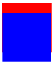

# 마진겹침 현상

마진겹침(Margin-Collpasing)이란 블록 레벨 엘리먼트(Block-level element)에 한해서 발생하는 현상으로, 좌우 방향으로는 적용되지 않고 **오로지 수직방향** 으로 적용된다. 2개의 마진이 겹칠 때 더 큰 마진으로 덮어 씌우는 방식이며 하나의 마진이 음수일 경우 더하는 방식을 취한다.

<br>

## 3가지 경우

마진겹침은 블록 레벨 엘리먼트라는 가정하에 3가지 경우에 한해서 발생한다.

1. **인접한 엘리먼트**

```html
<div class="element1"></div>
<div class="element2"></div>
```

```css
div {
  width: 100px;
  height: 100px;
  background-color: red;
}
.element1 { margin-bottom: 20px; }
.element2 { margin-top: 40px; }
```

<p align="center">

</p>

두번째 엘리먼트의 위쪽 마진이 더 크기 때문에 둘 사이의 간격은 40px이 된다.

2. **부모와 처음/마지막 자식 사이에서**

```html
<div class="parent">
  <div class="child">
  </div>
</div>
```

```css
div {
  width: 100px;
  height: 100px;
}
.parent {
  background-color: red;
  margin-top: 20px; 
}
.child { 
  background-color: blue;
  margin-top: 20px; 
}
```

<p align="center">

</p>

둘의 마진이 같기 때문에 20px이 된다. 이를 해결하기 위해선 **부모에 inline 컨텐츠, border, padding** 을 줘서 경계를 구분시키면 된다.

```css
.parent {
  background-color: red;
  border: 1px solid red;
  margin-top: 20px;
}
```

<p align="center">

</p>

3. **빈 엘리먼트**

```html
<div class="empty"></div>
<div class="element"></div>
```

```css
.empty { margin-top: 50px; }
.element {
  width: 100px;
  height: 100px;
  background-color: red;
  margin-top: 100px;
}
```

<p align="center">

</p>

높이가 없는 빈 엘리먼트가 인접해있을 때도 마진겹침이 발생하여 위쪽 마진은 100px이 된다. 이를 해결하기 위해선 **빈 엘리먼트에 height, min-height, padding, border나 inline 컨텐츠** 를 줘서 경계를 구분시키면 된다.

```css
.empty {
  border: 1px solid red;
  margin-top: 50px;
}
```

<p align="center">

</p>

<br>

## 예외 대상

`position: absolute` , `float: left` , `display: flex` 등 다양한 상황에 마진겹침이 발생하지 않지만, 그냥 **새로운 BFC(Block Formatting Context)를 생성하는 조건이 마진겹침을 발생시키지 않는다** 고 알아두면 된다.

<br>

## 참고

* [MDN, 마진 상쇄 정복](https://developer.mozilla.org/ko/docs/Web/CSS/CSS_Box_Model/Mastering_margin_collapsing)
* [Velog, CSS 마진 상쇄(Margin-collapsing) 원리 완벽 이해](https://velog.io/@raram2/CSS-%EB%A7%88%EC%A7%84-%EC%83%81%EC%87%84Margin-collapsing-%EC%9B%90%EB%A6%AC-%EC%99%84%EB%B2%BD-%EC%9D%B4%ED%95%B4#%EB%A7%88%EC%A7%84-%EC%83%81%EC%87%84-%EA%B7%9C%EC%B9%99-%EC%98%88%EC%99%B8)
* [Youtube, [ㅁ] 마진병합 margin collapsing | 코딩가나다 | 빔캠프](https://www.youtube.com/watch?v=c19Mjg-ivxc)
* [생활코딩, 마진겹침 현상](https://opentutorials.org/course/2418/13464)