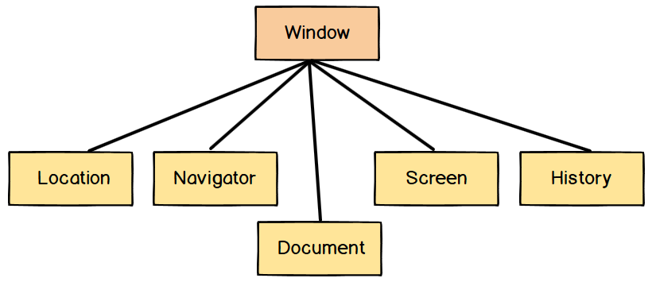
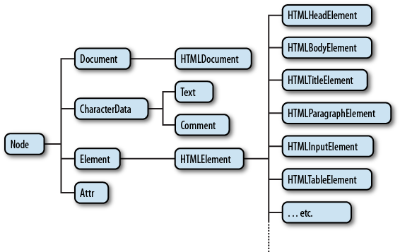
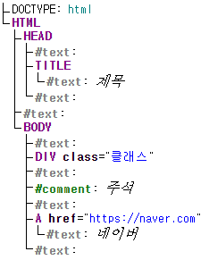

# BOM과 DOM

## BOM (Browser Object Model)

**브라우저의 창이나 프레임을 프로그래밍적으로 제어할 수 있게 해주는 객체모델** 이다. 이를 통해서 브라우저의 새 창을 열거나 다른 문서로 이동하는 등의 기능을 실행시킬 수 있다. 전역객체로 `window` 가 있으며 하위 객체들로 `location` , `navigator` , `document` , `screen` , `history` 가 포함되어 있다.



<br>

## DOM (Document Object Model)

**웹페이지를 프로그래밍적으로 제어할 수 있게 해주는 객체모델** 이다. 최상위 인터페이스로 Node가 있으며 이는 아래와 같은 구조로 나타난다.



[이미지 출처](https://web.stanford.edu/class/cs98si/slides/the-document-object-model.html)

위의 트리구조를 보면 엘리먼트 뿐만 아니라 텍스트와 주석도 있는 것을 알 수 있는데, 이런 것들까지도 DOM 트리에 포함된다. 실제적인 DOM 트리는 아래와 같이 생성된다.

```html
<!DOCTYPE html>
<html>
  <head>
    <title>제목</title>
  </head>
  <body>
  <div class="클래스"></div>
  <!-- 주석 -->
  <a href="https://naver.com">네이버</a>
  </body>
</html>
```

<p align="center">
	
</p>

[Live DOM Viewer](https://software.hixie.ch/utilities/js/live-dom-viewer/) 를 사용해서 DOM 트리를 구성해 본것으로 엘리먼트 뿐만 아니라 텍스트 노드와 주석 노드까지 포함하고 있다. 이제 이런 DOM을 다루기 위해선 `getElementsById` , `querySelector` , `firstElementChild` 등과 같은 브라우저가 제공하는 DOM API를 사용하면 된다.

<br>

## 참고

* [Javascript.info, DOM 트리](https://ko.javascript.info/dom-nodes)
* [생활코딩, 웹브라우저와 자바스크립트](https://opentutorials.org/course/1375)
* [Stackoverflow, What is the DOM and BOM in JavaScript?](https://stackoverflow.com/questions/4416317/what-is-the-dom-and-bom-in-javascript)