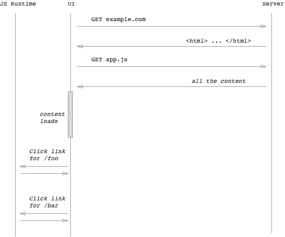
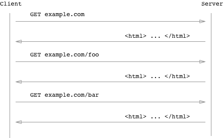

# CSR(Client Side Rendering)과 SSR(Server Side Rendering)

## SPA와 MPA

* **SPA (Single Page Application)**

하나의 HTML 파일을 기반으로 자바스크립트를 이용해 동적으로 화면의 컨텐츠를 바꾸는 방식의 웹 어플리케이션이다.

* **MPA (Multiple Page Application)**

사용자가 페이지를 요청할 때마다, 웹 서버가 요청한 UI와 필요한 데이터를 HTML로 파싱해서 보여주는 방식의 웹 어플리케이션이다.

전통적인 방식을 이용한다면, SPA가 사용하는 렌더링 방식은 CSR이고, MPA가 사용하는 렌더링 방식은 SSR이다. 각 방식의 동작방식과 장단점을 알아보고, 전통적인 방식을 벗어나, SPA에서도 적절히 SSR을 구현했을 때의 장점과 그 이유를 알아보자.

 

## CSR

[이미지 출처](https://medium.com/@adamzerner/client-side-rendering-vs-server-side-rendering-a32d2cf3bfcc)

CSR에선 브라우저가 서버에 HTML과 JS 파일을 요청한 후 로드되면 사용자의 상호작용에 따라 JS를 이용해서 동적으로 렌더링을 시킨다.

### :+1: 장점

* 첫 로딩만 기다리면, 동적으로 빠르게 렌더링이 되기 때문에 사용자 경험(UX)이 좋다.
* 서버에게 요청하는 횟수가 훨씬 적기 때문에 서버의 부담이 덜하다.

### :-1: 단점

* 모든 스크립트 파일이 로드될 때까지 기다려야 한다. 
  * 리소스를 청크(Chunk) 단위로 묶어서 요청할 때만 다운받게 하는 방식으로 완화시킬 수 있지만 완벽히 해결할 수는 없다.
* 검색엔진의 검색 봇이 크롤링을 하는데 어려움을 겪기 때문에 검색엔진 최적화(Search Engine Optimization)의 문제가 있다.
  * 구글 봇의 경우는 JS를 지원하지만, 다른 검색엔진의 경우 그렇지 않기 때문에 문제가 된다.

 

## SSR

[이미지 출처](https://medium.com/@adamzerner/client-side-rendering-vs-server-side-rendering-a32d2cf3bfcc)

SSR에선 브라우저가 페이지를 요청할 때마다 해당 페이지에 관련된 HTML, CSS, JS 파일 및 데이터를 받아와서 렌더링을 시킨다.

### :+1: 장점

* 초기 로딩 속도가 빠르기 때문에 사용자가 컨텐츠를 빨리 볼 수 있다.
* JS를 이용한 렌더링이 아니기 때문에 검색엔진 최적화가 가능하다.

### :-1: 단점

* 매번 페이지를 요청할 때마다 새로고침 되기 때문에 사용자 경험이 SPA에 비해서 좋지 않다.
* 서버에 매번 요청을 하기 때문에 서버의 부하가 커진다.

 

## 참고

* [Client-Side Rendering versus Server-Side Rendering!](https://altalogy.com/blog/client-side-rendering-vs-server-side-rendering/)
* [What are Single Page Applications(SPA)?](https://dev.to/kendyl93/what-are-single-page-applications-spa-32bh)
* [The Benefits of Server Side Rendering Over Client Side Rendering](https://medium.com/walmartlabs/the-benefits-of-server-side-rendering-over-client-side-rendering-5d07ff2cefe8)
* [싱글 페이지 어플리케이션에서의 검색 엔진 최적화 (SEO)](https://funnygangstar.tistory.com/entry/싱글-페이지-어플리케이션에서의-검색-엔진-최적화-SEO)
* [Google I/O 2019: Day 3 후기](https://hyunseob.github.io/2019/05/26/google-io-2019-day-3/)
* [[주니어탈출기] 서버사이드렌더링(SSR) & 클라이언트사이드렌더링(CSR)](https://velog.io/@zansol/확인하기-서버사이드렌더링SSR-클라이언트사이드렌더링CSR)
* [SPA 단점에 대한 단상](https://m.mkexdev.net/374)
* [CSR vs SSR](https://medium.com/@adamzerner/client-side-rendering-vs-server-side-rendering-a32d2cf3bfcc)
