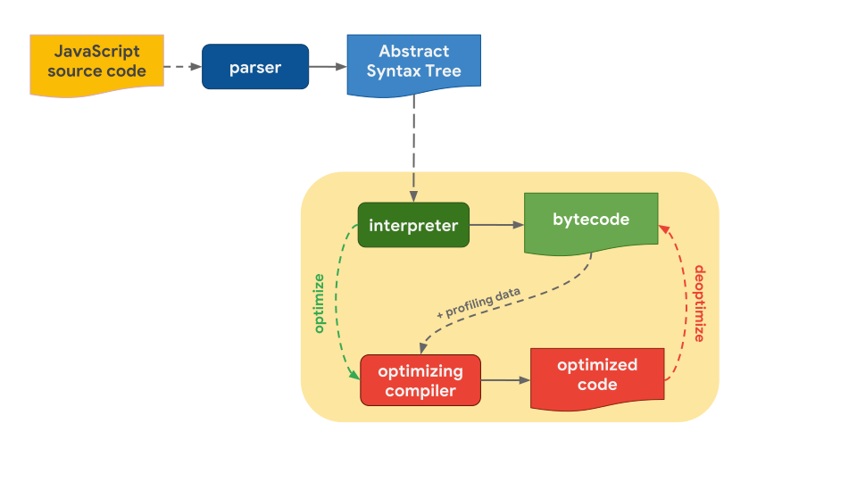

# 자바스크립트 엔진이 코드를 실행하는 과정

자바스크립트를 실행하기 위해선 자바스크립트 엔진이 필요하고 웹 브라우저는 자바스크립트 엔진을 내장하고 있다. 브라우저마다 엔진의 종류가 다르지만 코드를 실행하는 방식은 비슷하기 때문에 보통 어떻게 실행하는지 알아두는 것이 좋다. (V8, SpiderMonkey, Javascript core 등의 구현이 각각 다르다)

[이미지 출처](https://mathiasbynens.be/notes/shapes-ics)

* 소스코드를 만나면 파싱하여 **AST(Abstract Syntax Tree)** 로 변환한다.
* **인터프리터(Interpreter)** 는 AST를 기반으로 **바이트코드(Bytecode)를 생성** 한다.
* 인터프리터가 바이트코드를 실행할 때, 자주 사용되는 함수 및 타입 정보 등이 있는 **프로파일링 데이터(Profiling data)** 와 같이 **최적화 컴파일러(Optimizing compiler)** 에게 보낸다.
* 최적화 컴파일러는 프로파일링 데이터를 기반으로 **최적화된 코드(Optimized code)를 생성** 한다.
* 하지만, 프로파일링 데이터 중에 **잘못된 부분이 있다면 최적화 해제(Deoptimize)** 를 하고 다시 바이트코드를 실행해서 이전 동작을 반복한다.

 

## 참고

* [JavaScript engine fundamentals: Shapes and Inline Caches](https://mathiasbynens.be/notes/shapes-ics)
* [JavaScript 엔진 톺아보기 (1)](https://velog.io/@godori/JavaScript-engine-1)