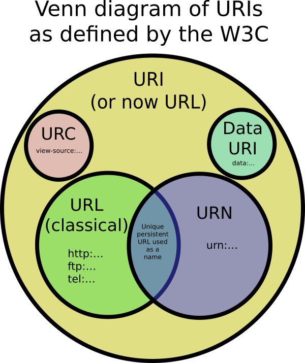

# URL과 URN을 포함하는 URI

## URI(Uniform Resource Identifier)

통합 자원 식별자라는 의미로 **인터넷 상의 리소스** 를 고유하게 식별할 수 있는 식별자이다. URI에는 위치를 알려주는 **URL(Uniform Resource Locator)** 와 전 세계를 통틀어 고유한 이름을 의미하는 **URN(Uniform Resource Name)** 이 존재한다.

 

## URL(Uniform Resource Locator)

**해당 위치에서 어떻게 리소스를 얻어낼 것인가에 대한 정보를 포함한다.**

현재 내가 거주하고 있는 기숙사를 대학교라고 가정한다면, 그 주소는 다음과 같이 쓸 수 있다.

> 경북 포항시 북구 흥해읍 한동로 558, 한동대학교 벧엘관 303호

여기서 이 방에 **나 혼자 산다면** 나라는 자원에 대한 유일한 지시자가 된다. 또한 이는 내가 거주하고 있다는 것을 간접적으로 알려주기 때문에 식별의 역할도 하고 있다. 그러나 룸메이트가 오게 되면 나라는 자원을 유일하게 지시하는 기준은 달라지게 된다. 따라서, 자원의 위치가 바뀔 수 있다고 할 수 있는 것이다. 이러한 문제점은 URN의 출현을 야기시켰다.

 

## URN(Uniform Resource Name)

**리소스를 유일하고 영구적인 이름으로 식별하지만 인터넷 상의 위치는 알려주지 않는다.**

만약, 지구상에 "배하람" 이라는 이름이 유일하다면 URN의 조건에 부합하게 된다. 즉, 매번 바뀌는 위치가 아닌 **유일한 식별자인 이름을 기준** 으로 자원을 식별하겠다는 의도이다.

 

## 사용 예시

* **URL**
  * http://example.com/mypage.html (프로토콜: http)
  * ftp://example.com/download.zip (프로토콜: ftp)
  * mailto:user@example.com (프로토콜: mailto)
* **URN**
  * urn:isbn:0451450523 (책을 식별하는 ISBN 번호)
  * urn:uuid:6e8bc430-9c3a-11d9-9669-0800200c9a66 (전 세계에서 유일한 번호)

 

## 참고

* [URI vs URL vs URN :: 마이구미](https://mygumi.tistory.com/139)
* [URI](https://johngrib.github.io/wiki/URI/)
* [What is the difference between a URI, a URL and a URN?](https://stackoverflow.com/a/1984225/11789111)